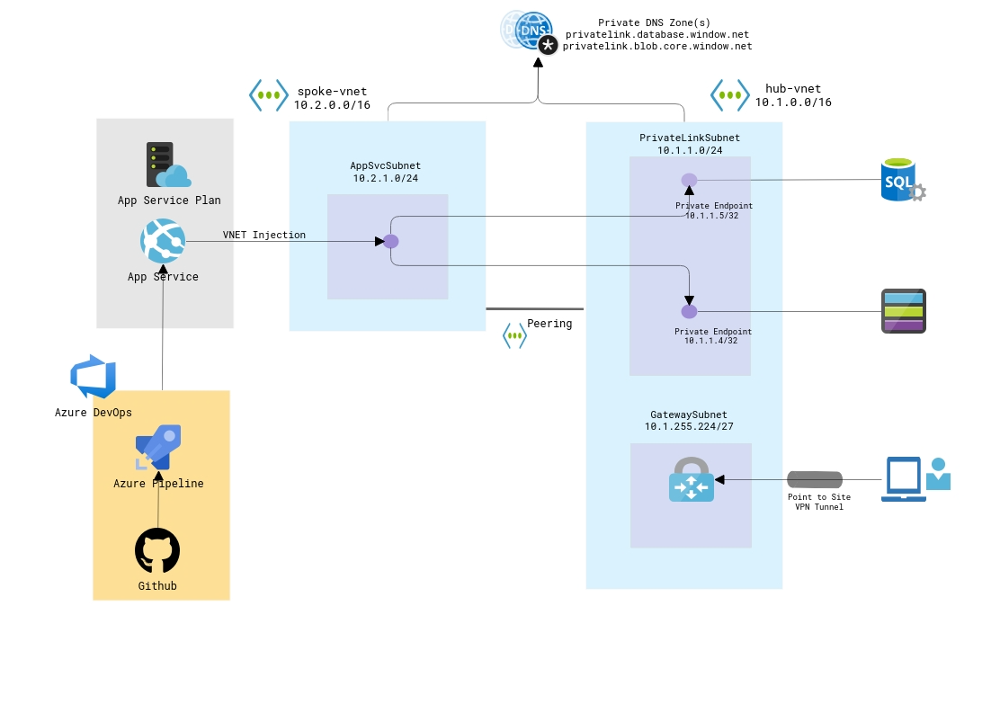

# Azure App service web app regional vNet integration, SQL DB and Azure Storage account Private endpoint scenario

## Overview

This solution deploys a hub & spoke network architecture where in it deploys a Linux Azure App Services web app into a subnet (using regional virtual network integration) on the spoke network. An Azure SQL DB and a storage account are also created, each with its own private link and private DNS resources to allow access from the web app over a private address space. Private endpoints are created on the hub network. Firewall rules are added to the storage account to prevent public access & the Azure SQL Server is configured to disallow public traffic. A dns record is created in each zone for the Azure SQL Server and storage account.

The solution also deploys a VNET Gateway for point-to-site VPN clients (user persona - DBA, Storage Account Owners) to manage these resources over a private address space.

As part of the hub & spoke network architecture, solution also deploys another spoke network - OnPrem-Vnet to demonstrate how client apps running on-premise can connect to azure sql/storage via the private endpoint and covers the configuration to accomplish the DNS resolution flow

The following resources are deployed as part of this solution

- Hub Virtual Network (10.1.0.0/16)
  - PrivateLinkSubnet (10.1.1.0/24)
  - GatewaySubnet (10.1.255.224/27)
  - DnsSubnet (10.1.240.224/27)
  - AzureBastionSubnet (10.1.240.128/27)
- Spoke Virtual Network(10.2.0.0/16)
  - AppSvcSubnet (10.2.1.0/24)
- On-Prem Virtual Network (10.3.0.0/16)
  - DefaultSubnet (10.3.1.0/24)
  - DnsSubnet (10.3.240.224/27)
  - AzureBastionSubnet (10.3.240.128/27)
- Virtual Network peering between hub and spoke virtual networks
- Azure SQL Server
  - Azure SQL DB
  - Private link
  - Private DNS zone
- Storage account
  - Private link
  - Private DNS zone
- App Service Web app
  - Regional virtual network integration
  - Runtime Stack DOTNETCORE 3.1
- DNS Server VMs
  - DNS forwarder on Hub Vnet / Dns subnet
  - Custom DNS on OnPrem Vnet / Dns subnet

  Note that for traffic to pass from the web app to the private endpoints, the following web app environment variables must be set in the app.json nested template.

  "siteConfig": {
                    "appSettings": [
                        {
                            "name": "WEBSITE_VNET_ROUTE_ALL",
                            "value": 1
                        },
                        {
                            "name": "WEBSITE_DNS_SERVER",
                            "value": "168.63.129.16"
                        }
                    ]
                }

## Scenario Deployment Validation

To validate that the web app can resolve the private endpoints for the Azure SQL DB and storage account follow the steps below.

- Navigate to the Azure web app and select the 'SSH' blade and then click the 'Go ->' hyperlink
- A new web page will open displaying the web app's ssh host
- In the SSH host console, type the following commands to test that name resolution is working for both the Azure SQL DB and storage account. The private IP address for each resource should be returned.
  - `~/site/wwwroot# nslookup <storage account name>.<storage account private DNS zone name>`
  - `~/site/wwwroot# nslookup <Azure SQL DB name>.<Azure SQL DB private DNS zone name>`

## Sample Code

The App service is deployed with DOTNETCORE 3.1 LTS runtime stack.  In order to have a functional app, I have a simple Todo list web app (.NET Core 3.1) that can be deployed to this App Service. Add a new connection string "MyDbConnection" and point to the azure sql FQDN deployed in the previous steps.  The repository also contains yaml based build/release pipeline as starting point.

[ToDo Task Sample Code](https://github.com/saikovvuri/dotnetcore-azurepipeline)

## Architecture Diagram

